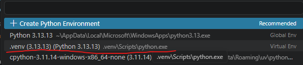

# ECE609-XAI-Lab

Run this in powershell to set up your environment
```
py -m venv .venv
.venv\Scripts\Activate.ps1
pip install -r requirements.txt
```

Then select the .venv virtual envrionment as your Jupyter kernel
